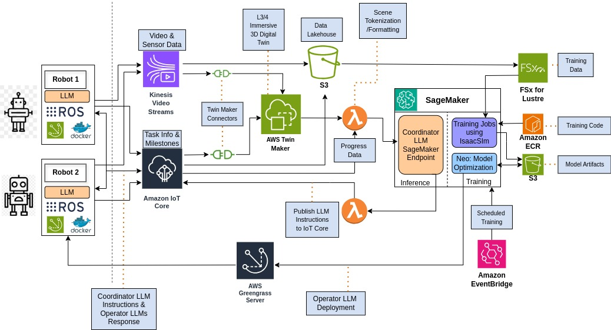

# Robotic Fleet Coordinator Inference Architecture


[Design Details](#chosen-architecture)

This design document outlines the inference, deployment, and training pipelines for a hypothetical multi-physical agent coordination system for autonomous construction machinery or similar use cases. This document is over simplified, and the actual implementation of such a production system would be much more involved. However, this design showcases some recent developments in AI, robotics, cloud, and simulation technologies that could enable a system to be realized in the near future (<10 years). I hope you share my enthusiasm for the possibilities!

## Outline
1. [Purpose](#purpose)
2. [Background](#background)
3. [Requirements](#requirements)
4. [Design](#design)
5. [Conclusion](#conclusion)

## Purpose
To truly leverage physical AI at a large scale, a coordination framework between different agents is necessary to align the individual workcell (autonomous mobile robots) objectives with higher level goals. This design uses a building construction project as an example to highlight how coordination-enabled autonomous robotics can achieve such a task using AWS cloud services. This design achieves this by creating a virtual digital twin using AWS IoT Twinmaker to create a live model of the work site/environment and a Vision-Language-Action (VLA) Model to comprehend the scene and send top-down instructions from an example instruction set. On the Edge, Operator VLA models comprehend top-down instructions from the cloud and ouput low level controls. The incoming video data is streamed and stored to create the digital twin but to also create a data lake for offline periodic training using simulation software like IsaacSim. Higher level orchestration and planning must be a coordinated effort acrossh

## Background
The first key insight driving this robot coordinator design is the principle of distributed processing for multi-agent orchestration. When coordination is centralized, the computational complexity grows exponentially with each additional agent (O(2^n) complexity), quickly becoming intractable. By distributing the processing load across individual agents, we can approach linear scaling (O(n) complexity), allowing the system to efficiently handle larger agent populations while maintaining responsive coordination.

This problem is known as the combinatorial explosion problem in AI planning and coordination. This problem describes how the state space and decision complexity grow exponentialy with more agents and interactions in a system.

To address this complexity explosion, we can shift at least part of the computational burden of local decision making, such as movement control and path planning, to each agents processor. Each agent processes its own environmental data and coordination requirements. This circumvents the problem of central processing complexity explosion by distributed computing. 

Multi-agent coordination is an emerging field as of Feburary 2025, particulary in physical AI since powerful physically intelligent agents are not commonplace. However, both industry and academia are working on advancing intelligent embodiments. In the past year, companies like Figure, Tesla, Boston Dynamics, Unitree, and 1X are rapidly building and productizing human-form robots. Based on analysis at the beginning of the Background(#background)

### Prior work in Multi-Agent Coordination
There has been some work in multi-agent alignment and coordination. However most of the use cases are about agentic AI or LLMs. For example, OpenAI released swarm, an opensource framework to create a state machine of language models that can invoke other language models to take over. As it states in its READme, it showcases the handoff & routines patterns explored in [1].

### Comparison with Fleet Management
This architecture is similar to traditional fleet management but leverages large multimodel models to create more alignment on higher lever goals. Traditional fleet management uses traditional routing and scheduling algorithms. These systems typically rely on predetermined paths, fixed schedules, and basic obstacle avoidance. They excel in controlled environments like warehouses but struggle with dynamic, unstructured environments. Traditional fleet management also lacks semantic understanding of the environment and mission context, operating purely on spatial coordinates and basic rules.

This is especially important for dynamic environments like construction sites where the real environment changes over time. Fleet management with multimodal AI becomes more important in unpredictable and changing environments. Another example use case is coordinating and commanding a group of battle drones in unknown enemy territory. The real advantage in this architecture is leveraging real time understanding simular to how humans operate.  

In addition, even modern warehouses still rely on human operators/laborers for about 30-50% of the work. To fully integrate autonomous systems into construction sites, which are far more complex and dynamic than warehouses, more advanced coordination and intelligence capabilities are required. This underscores the need for AI-powered fleet management that can handle unstructured environments and adapt to changing conditions in real-time.

Lastly, while traditional fleet management shines in warehouse and factory settings for predictable workloads, to fully transition to full autonomous construction, a more intelligent fleet management system should be used. This requires near real-time understanding of the environment and the ability to adapt to changing conditions. The use of advanced AI models for coordination enables this flexibility while maintaining efficient operation across multiple autonomous agents.

## Design Tenents
1. **Hierarchical Intelligence Distribution** - Balance computational load between cloud coordination and edge autonomy to achieve linear scaling (O(n)) rather than exponential complexity (O(2^n)) as the robot fleet grows.
2. **Continual Learning** - Implement seamless Sim2Real and Real2Sim pipelines that allow the system to improve through both simulated experience and real-world operations.
3. **Multi-resolution Coordination** - Support both high-level strategic planning and low-level tactical coordination between nearby agents without requiring constant cloud communication.
4. **Explainable Operations** - Maintain transparency in decision-making to support debugging, safety verification, and human oversight of autonomous operations.

## Design
### Chosen Architecture


### Major Cloud Service Decisions
**Kinesis Video Streams** is the optimal choice for our architecture because it's specifically designed to handle continuous high-resolution video and sensor data streams from multiple robots simultaneously, which is shown in the diagram as a primary input channel. Unlike Kinesis Data Streams, which is optimized for text-based telemetry, Kinesis Video Streams provides native support for time-indexed video frames and large binary sensor data (like LiDAR point clouds) that are essential for creating the immersive L3/4 3D Digital Twin shown in our architecture. While IoT Core could technically transport this data, it's optimized for small, intermittent messages rather than continuous high-bandwidth video streaming. Kinesis Video Streams offers specialized features for video processing including frame-level indexing, built-in video playback capabilities, and integration with media processing services that IoT Core doesn't provide. This direct integration pathway enables near real-time digital twin updates and ensures that all visual data is properly synchronized with the task information flowing through IoT Core, providing a situational awareness for the Coordinator model on the cloud.

**S3** was chosen for this architecture's storage needs due to its versatility in handling the diverse data types present in our system. As shown in the diagram, S3 serves multiple critical functions: storing raw video data from Kinesis, maintaining the Data Lakehouse, preserving Training Data, and archiving Model Artifacts. Unlike Redshift, which is optimized for structured analytical workloads, S3 excels at storing unstructured binary data such as video frames, LiDAR scans, and serialized digital twin states. DynamoDB, while excellent for low-latency access patterns, has significant limitations on object sizes (400KB per item) that make it impractical for storing the large sensor datasets, training corpuses, and model weights required by our system. The diagram illustrates how S3 integrates seamlessly with multiple components: it feeds data to FSx for Lustre for high-performance training workloads, connects to the Data Lakehouse for analytics, and stores model artifacts from training jobs. Additionally, S3's tiered storage classes enable us to implement cost-effective data lifecycle policies, keeping frequently accessed training data in Standard tier while moving historical construction site data to lower-cost tiers—functionality neither Redshift nor DynamoDB offers. S3's inherent scalability also eliminates the capacity planning required for database solutions, allowing our storage to grow elastically with the fleet size.

**FSx for Lustre** is used in this architecture due to its high-performance file system capabilities, which are essential for training complex VLA models. The distributed nature of Lustre provides the parallel throughput necessary when processing massive simulation datasets from IsaacSim. With read/write speeds up to hundreds of GB/s and sub-millisecond latencies, it significantly accelerates model training iterations. Additionally, its direct integration with S3 creates a seamless pipeline between our data lake and training infrastructure, allowing us to efficiently move data between storage tiers based on computational needs.

**AWS IoT Greengrass** was chosen as our edge runtime for our robot fleet as it enables local processing of data when connectivity is limited—a common scenario at construction sites. Its ability to run containerized applications means we can deploy optimized versions of our Operator VLA models directly to each robot. The built-in device shadow functionality maintains synchronization between physical robots and their digital twins, even during intermittent connectivity. Greengrass also provides robust OTA (Over-The-Air) update capabilities, allowing us to deploy model improvements to the entire fleet securely. The local messaging capabilities further reduce latency for time-sensitive operations when robots need to coordinate without cloud roundtrips.

Lastly, **lambda functions** serve as critical connective tissue in our architecture, performing essential data transformation and service integration tasks that would otherwise require dedicated servers. As shown in the diagram, Lambda functions appear at two pivotal junctures: processing data from TwinMaker and publishing instructions to IoT Core. The first Lambda function transforms the digital twin state data into a format digestible by the Coordinator LLM, handling the complex task of scene tokenization and formatting. This stateless processing is perfectly suited for Lambda's event-driven model, as it can scale instantly to handle variable workloads when multiple construction sites update simultaneously. The second Lambda function translates the Coordinator LLM's high-level instructions into specific command formats compatible with IoT Core's messaging system, ensuring robots receive properly structured directives. Unlike container-based solutions that would require constant running resources, these Lambda functions execute only when needed, significantly reducing costs during periods of inactivity (such as overnight or weather delays). Additionally, Lambda's native integration with both AWS services shown in the diagram eliminates the need for custom authentication and connection management code that would be required with EC2 instances. The serverless nature of Lambda also removes operational overhead for patching and scaling, allowing the development team to focus on improving the coordination logic rather than infrastructure management.

### Workflow

The following lists the data flow steps from robots on the edge the Coordinator AI model on the cloud, and the communication back from the cloud to robots working on the edge, completing a full loop.
1. Robots on the edge operate autonomously via Vision Language Action Models based on prior instructions given by an AI model on the cloud.
2. Video and Lidar Data is streamed to cloud services via Kinesis video streams. Progress task data is sent to AWS Iot Core. Both sources of data are stored as training data in the cloud AND used to create a virtual digital twin of the operating environment.
3. Creating a Live Digital Twin using AWS IoT TwinMaker Scene Composer from video, lidar, robot, and task progress information. 

[Inference Steps](#during-inference)
[Training Steps](#during-training)

### During Inference: 
4. The digital twin's data needs to be tokenized for the coordinator AI model to ingest. This is done by using a lambda to access the digital twin data, and perform a tokenization operation.
5. The Coordinator VLM model processes the tokenized digital twin data, generating a comprehensive understanding of the entire worksite, including task progress, robot positions, and environmental conditions.
6. Based on this holistic view, the Coordinator VLA generates high-level instructions and coordination directives for the robot fleet that align with project objectives.
7. A Lambda function transforms these high-level directives into properly formatted IoT messages suitable for transmission to the robots.
8. AWS IoT Core distributes the specific instructions to each robot through secure MQTT channels.
9. On each robot, the Operator VLA running on AWS IoT Greengrass receives and interprets these instructions within its local context.
10. The Operator VLA translates high-level directives into specific control actions appropriate for its particular robot type and capabilities.

### During Training:
4. Historical data from operations is stored in S3 and organized in a Data Lakehouse structure for training purposes.
5. NVIDIA IsaacSim creates high-fidelity simulated environments based on real construction site data collected from the digital twin.
6. ML training jobs run on SageMaker using FSx for Lustre for high-performance data access, developing improved versions of both Coordinator and Operator VLA models.
7. Trained models undergo validation against real-world scenarios before being packaged as model artifacts in S3.
8. Approved model updates are deployed to the robot fleet via OTA updates through IoT Greengrass, completing the Real2Sim2Real learning cycle.

### Coordinator-Operator Communication Protocol
An open problem is what is the most efficient protocol that these VLMs communicate with. Depending on how advanced and large the AI models are (both on the edge and on the cloud), different options could be better than others. Additionally, combinations of data formats could prove to be the most viable option. 

Natural Languages (English)
We can use natural languages to describe generally what tasks each robot needs to accomplish. For example: 
```
Coordinator VLM -> Backhoe VLM
Message: 
    "Task: Transport spoil material excavated by Unit E-3 to the designated disposal area."

Backhoe VLM -> Coordinator VLM 
Message: 
    "Unit E-3 is currently operating in grid sector B7 with approximately 8.2 cubic meters of spoil material accumulated.
    Route analysis complete. Initiating transport sequence via Path C to designated disposal area. 
    Estimated time to completion: 14 minutes.
    Current fuel level at 72%.
    Requesting confirmation of disposal area coordinates to ensure alignment with site management plan."

Coordinator VLM -> Backhoe VLM
Message: 
    "Confirmation: Disposal area coordinates verified at grid reference F9-12.
    Priority level for this task is medium. 
    Proceed with transport operation and maintain standard separation from other active units."

Backhoe VLM -> Coordinator VLM 
Message: 
    "Acknowledged. Transporting spoil material to grid F9-12. Will maintain standard 15-meter separation from other units.
    Path C selected with terrain-adaptive suspension engaged due to recent rainfall. 
    Load secured with stability monitoring active. Will report completion status and return to staging area D3 as instructed. 
    Telemetry data streaming at 5-second intervals."
```

Pros:
- Human readable and interpretable
- Flexible and expressive
- Easy to debug and modify
- Natural for high-level instructions
- Works well with existing LLMs

Cons:
- Ambiguous and prone to misinterpretation
- Less efficient than structured formats 
- Higher bandwidth requirements
- Harder to validate/enforce schemas
- May require additional parsing overhead

Data Serialization Languages (JSON)
This includes data formats like protobuf and even MQTT protocols. This is essentially the same as natural language, but with more structure. Using specific data formats assumes that more formatted data has a higher signal to noise ratio. For instance:

```
Coordinator VLM -> Backhoe VLM
Message: 
    {
    "message_id": "CMD-2025-03-02-001",
    "message_type": "TASK_ASSIGNMENT",
    "priority": 2,
    "task": {
        "action": "TRANSPORT",
        "material": "SPOIL",
        "source": {
        "unit_id": "E-3",
        "type": "EXCAVATOR"
        },
        "destination": {
        "type": "DISPOSAL_AREA",
        "id": "DEFAULT"
        }
    },
    "timestamp": "2025-03-02T14:32:15Z"
    }

Backhoe VLM -> Coordinator VLM 
Message: 
    {
    "message_id": "RSP-2025-03-02-001",
    "message_type": "TASK_ACKNOWLEDGEMENT",
    "reference_id": "CMD-2025-03-02-001",
    "status": "EVALUATING",
    "source_status": {
        "unit_id": "E-3",
        "grid_location": "B7",
        "material_volume": 8.2,
        "material_unit": "CUBIC_METERS"
    },
    "execution_plan": {
        "route": "PATH_C",
        "eta_minutes": 14,
        "fuel_level_percent": 72
    },
    "requests": [{
        "request_type": "COORDINATE_CONFIRMATION",
        "parameter": "DISPOSAL_AREA"
    }],
    "timestamp": "2025-03-02T14:32:18Z"
    }
...
```
Pros:
- More structured and explicit
- Efficient data transmission
- Easy to validate schemas
- Standardized parsing
- Lower bandwidth usage

Cons:
- Less human readable
- More rigid/less flexible
- Requires specific schema definitions
- May not capture nuanced instructions
- Additional serialization overhead

Natural language has the advantage of leaving more up to Operator agents to decide specific instructions. We can see this in RT-2 [3], the vision language action model developed by google that translates natural language directly to robotic control. In

Other Considerations
- Programming languages like Python or OCaml are not suitable for this task since they fall too close to the extreme of centralized processing. Using them as a communication protocol leave very little room for local processing.
- Learned communication protocols and other AI agent optimized communication protocols (MQTT) are similar to data serialization languages but are less interpretable.

### Training in NVIDIA IsaacSim
Another design consideration that was addressed is how the system learns. This design follows the Simulation to Reality (Sim2Real) paradigm. This choice attempts to address is the problem of lack of abundant training data for robots like construction vehicles. This design uses the Sim2Real approach that is advocated by nvidia.[4] The logn term goal is to remove the need for manual human teleoperators and demonstrators from the loop entirely. All training can be done in simulation, and real world fine tuning can be done on the edge.[5] Furthermore, real data collected by devices can continuously create more quality simulations in the future which fits into the CI/CD paradigm.

## Summary
This project outlines a potential implementation of a modern fleet management system using LLMs for dynamic environments like construction sites. The proposed architecture balances cloud-based coordination with edge autonomy to achieve linear scaling as fleet size increases, addressing the combinatorial explosion problem in multi-agent systems. By distributing intelligence hierarchically between cloud-based Coordinator VLMs and edge-based Operator VLA models, the system can maintain both strategic oversight and tactical flexibility.

The continuous learning pipeline integrating real-world operations with simulated training in IsaacSim creates a self-improving system that becomes more capable over time. This Real2Sim2Real approach overcomes the data scarcity challenge inherent in physical robotics applications while enabling safe experimentation in the virtual domain before deployment.

Unlike traditional fleet management systems limited to predefined paths and simple rules, this architecture provides semantic understanding of dynamic environments through multimodal AI, enabling autonomous adaptation to changing conditions. As construction sites and other unstructured environments increasingly adopt autonomous systems, this coordination framework represents a critical advancement toward fully autonomous operations that align with high-level project objectives while maintaining safety, efficiency, and explainability.

## References
1. [Orchestrating Agents: Routines and Handoffs - Ilan Bigio (OpenAI)](https://cookbook.openai.com/examples/orchestrating_agents)
2. [Eureka: Human-Level Reward Design via Coding Large Language Models](#https://eureka-research.github.io/)
3. [RT-2](#https://robotics-transformer2.github.io/)
4. [Sim-to-Real](#https://developer.nvidia.com/blog/training-sim-to-real-transferable-robotic-assembly-skills-over-diverse-geometries/)
5. [Real2Sim2Real: Self-Supervised Learning of Physical Single-Step Dynamic Actions for Planar Robot Casting](#https://ieeexplore.ieee.org/document/9811651)
